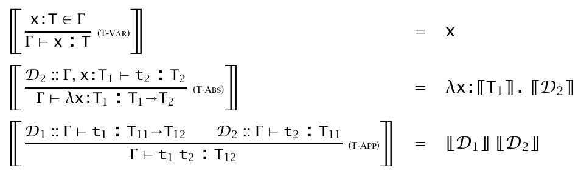
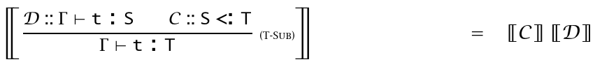

# 9. Simply Typed Lambda-Calculus

* Type context $\Gamma$

    * $\Gamma$ 是二元关系 $t:T$ 的集合，或者可以理解为 `term => type` 的字典

* Type relation

    * Type relation 确定了此 calculus 是 well-typed 的。即对于任意 term `t`，在一定的 context $\Gamma$ 下，都能找到 type `T` 使得 $\Gamma\vdash t:T$
    * Type relation 是一个三元组，因为它需要一系列 assumption (context) 来确定 `t` 中所有 free var 的 type

* T-Abs 的理解
    $$
    \frac{\Gamma,x:T_1\vdash t:T_2}{\Gamma\vdash \lambda x:T_1.t:T_1\to T_2}
    $$

    * 对于 premise：在 $\Gamma \cup \{x:T_1\}$ 这样的 context 下，有 $t:T_2$
        * 我们先**不加说明地**给出一个 type assumption $x:T_1$ ，`x` 不在 `t` 中出现，是 `t` 的 free var。这样做是为了我们之后能写出带 annotation 的 lambda
        * 这里的 $\Gamma$ 可能包含 $t$ 中的 nested variables 的类型信息，所以不能省略
    * 对于 conclusion：在 $\Gamma$ 这样的 context 下，我们可以给出 simply typed (params with type annotation) 的一个 lambda application 表达式 $\lambda x:T_1. t$，整个表达式的类型是 $T_2$
        * （**重要**）这里我们将 $x:T_1$ 从 context 中移除，是因为 $x$ 不再是 free var

* T-Var 的理解
    $$
    \frac{x:T\in\Gamma}{\Gamma\vdash x:T}
    $$

    * 如果我们已经给出了 assumption `x:T`，那么 term `x` 的类型就是 `T`
    * （**重要**）参考 type relation，任何一个 term 的类型的确定，一定需要 $\Gamma$
    * 注意此处的逻辑顺序：一定是先**不加说明地**给出 assumption，才能确定 term 的 type。**Term 不是天生就拥有 type 的**
    * 这里的“不加说明”可以理解为在逻辑系统之外，来自于用户手动指定的语义

* T-App，无需赘言

    

    

# 15. Subtyping

* Calculus $\lambda_{<:}$ , simply typed lambda-calculus with subtyping

* `S` in a subtype of `T`, written as `S <: T`

* Subsumption rule, `Gamma|-t:S  S<:T  /  Gamma|-t:T `

    * Upcast

* Subtype (Subset sematic)

    * 子类型是包含 closed value 更少的类型（前提是这两个类型的 closed value set 有包含关系），例如 `{x:int, y:int} <: {x:int}`

* 比较 Record 和 Variant

    * Record 的 entry 之间取并集，Variant 取交集
    * 越长的 Record 越是子类型，Variant 反之 
    * 复习一下 Variant：格式 $\lang l_0 :T_0,\cdots\rang$，其中 $l_i$ 是 label。例如 `type Info = <id:Int, name:String>` 或 `type Color = <Red:(), Green:(), Yellow:()> `，使用的时候用 case 语句模式匹配

* The subtype relation is

    * Reflective, `S<:S`
    * Transitive, `S<:U  U<:T  /  S<:T`
    * **Not** anti-symmetric, `{x:bool, y:int} <: {y:int, x:bool}` and vise versa

* **Arrow Rule**
    $$
    \frac{T_1<:S_1\ \ \ \ S_2<:T_2}{S_1\to S_2<: T_1\to T_2}
    $$

    * Argument types: Contravariant
    * Return types: Covariant
    * 函数 `f:S1->S2` 若能接收 `S1` 类型的参数，那它一定能接收 `S1` 的子类型 `T1` 的参数；
    * 函数 `f` 的返回值若是 `S2` 类型，i.e. 能被 `S2` 类型的变量接收，那它一定也能被 `S2` 的父类型 `T2` 的变量接收。

* Note: 我们一般不认为 `T1*T2 <: T1`，但却有 `{x:T, y:U} <: {x:T}` 。这是因为 record 类型中每个 entry 都有对应的 key，但 tuple 的 entry 只与 index 相关。

    * 你也不想 `(4, 'hello') + 1` 是 well-typed 的吧

* Bottom

    * rule: ` / Bot <: T`
    * `Bot` type is empty. There is no closed values of type `Bot`。这是显然的，否则若 value `v : Bot`，那么对于任意 `T` 都有 `v : T`，构造一个反例：`v:int` 并且 `v:string`
    * 允许有 term `t : Bot`，只要这个 `t` 不继续被 evaluate，eg: panic，这样使得 `if x then 1 else panic` 能够有类型 `int`
    * 会使得 type checker 复杂化。不能直接从 term 推断类型（eg，对于上例，不能假定 panic 是 `int`，因为也可能是 `Bot`）

* Ascription / Casting

    * Upcast: Subsumption
    * Downcast: `Gamma|-t:S  /  t as T : T`，在 Java 和 cpp 中， `t as T` 写作 `(T)t`。这里不做静态类型检查，而是插入 runtime 检查语句

* List

    * Covariant constructor, i.e. `S <: T  /  List S <: List T`

* Reference

    * Invariant constructor, i.e. `S<:T T<:S  /  Ref S <: Ref T`
        * For ref read: `x = !r`, if `x : T` and `r : Ref S`, then we need `S <: T`
        * For ref write: `r := x`,  if `x : T` and `r : Ref S`, then we need `T <: S`

    * Source / Readonly Ref / Const Ref: Covariant. `Ref T <: Source T`
    * Sink /  Writeonly Ref: Contravariant. `Ref T <: Sink T`
    * 由于 Array 也可以看做一种 Ref, `Array` constructor 也是 invariant 的 
    * List 是 readonly 的 array，所以它是 covariant 的


## 15.6 Coercion Sematic for Subtyping

* 一些反思：

    * `Int <: Float` 在机器表达上不是 subset 关系。一种解决方法是，将字面量 box 成对象，使得 `1` 和 `1.0` 有相同的表示，再在进行运算时 unbox。这会引入运行时开销。
    * Permutation rule of record 使得 record 的 projection 操作寻址困难，需要线性 search。C++ / Java 等语言均不允许 Permu rule，而是在编译期将 record 编译成 tuple，每个 label 有编译期确定的 offset

* Coercion sematic 是一个 **translation function**，它会：把有 Subtyping 的语言转换为无 Subtyping 的语言，并在合适的地方插入 Runtime  Coercion 语句（例如，类型转换等）

    * TAPL 中选择将 $\lambda_{<:}$ 转换为 $\lambda_{\to}$
    * 记做 $[\![\cdot]\!]$

    * 这样避免了每次 box/unbox 和 search，因为只在需要的地方插入了 coercion，如类型转换指令

* （**重要**）这样的 translation func 分为三个部分

    * 针对 types 的
    * 针对 subtyping derivations 的
    * 针对 typing derivations 的

* **针对 types 的**

    * 将 $\lambda_{<:}$ 中的特殊类型移除，这一过程是递归的
    * 对于 $\lambda_{<:}$ 中的类型 $T$，$[\![T]\!]$ 的结果是 $\lambda_{\to}$ 中的类型
    * $[\![Top]\!]=Unit$
    * $[\![T_1\to T_2]\!]=[\![T_1]\!]\to[\![T_2]\!]$ 等等

* **针对 subtyping derivations 的**

    * 插入 Runtime Coercion，有些类似于编译原理中文法的动作符号
    * 引入记号 $C$，表示一棵 derivation tree。记号 $C::T<:U$ 表示：在 deri tree $C$ 下，可以推出 $T<:U$
    * $[\![C]\!]$ 的结果是一个 $\lambda_{\to}$ 中的函数，也就是之前提到的 Runtime Coercion 
    *  
    * 注意右式中，部分 $[\![\cdot]\!]$ 是针对 types 的，部分是针对 subtyping 的
    * 通过以上 translation 规则做归纳，得出**重要 Lemma**：If $C::T<:U$, then $\vdash[\![C]\!]:[\![T]\!]\to[\![U]\!]$
        * 可以看出 $[\![C]\!]$ 就是一个 Runtime Coercion。若 $C::T<:U$，将 $[\![C]\!]$ 记做 $[\![T<:U]\!]$，可以给出一些例子：
        * `[[Int <: String]] = intToString`
        * `[[Bool <: Int]] = λb:Bool. if b then 1 else 0`
        * 参考下文的 4 式理解

* **针对 typing derivations 的**
    * 只是简单地翻译 term（如果有 subsumption，同时也插入 runtime coercion）
    * 同样有记号 $D$ 表示 deri tree
    * $[\![D]\!]$ 结果是一个 $\lambda_{\to}$ 中的 term
    *  
    * （书上有个 typo，上方 2 式的 conclusion 少写了一个 $t_2$ ）
    * **重要 Lemma**：If $D::\Gamma\vdash t:T$, then $\vdash[\![\Gamma]\!]:[\![D]\!]:[\![T]\!]$
        * 可以看出 $[\![D]\!]$ 就是一个 term
    
    * 关注 4 式，可以看到，有向上转型发生时，不止翻译了 term 为 $[\![D]\!]$，还插入了一个 runtime coercion $[\![C]\!]$
    * 针对 typing derivations 的翻译也叫 *Penn Translation*
    
* **Coherence**
    * 针对 typing 的 translation func $[\![D]\!]$ 是 coherent 的，iff：$\forall D_1,D_2$ ，若满足 $D_1::\Gamma\vdash t:T $ 并且  $D_2::\Gamma\vdash t:T$，即 conclusion 相同，那么有 $[\![D_1]\!]=[\![D_2]\!]=t$，其中 $t$ 是 $\lambda_{\to}$ 的 term
    * 复杂类型系统的 coherence 证明是不容易的


## 15.7 Intersection and Union Types

* **Intersection type** $T_1\and T_2$，它的 inhabitants 是 $\{t|t\in term_{T_1}\cap term_{T_2}\}$，语义是 both：如果 $t:T_1\and T_2$，那么 $t$ 既是 $T_1$ 也是 $T_2$
* 性质：
    * `T1^T2 <: T1, T1^T2 <: T2`
    * `S<:T1  S<:T2  /  S<:T1^T2`
    * `S->T1 ^ S->T2  /  S->(T1^T2)`
        * 如果一个函数既返回 T1 又返回 T2，那么它一定符合返回 $T_1 \and T_2$ 的 context
* *Finitary Overloading*
    * 例如，add 函数的类型可以是 `(Nat -> Nat -> Nat) ^ (Float -> Float -> Float)`
* Intersection type 过于灵活，应用较少
* **Union type** $T_1\or T_2$，定义反之，取交集。语义是 either
* 这称为 **Non**-disjoint union type，区别于 disjoint union type，即常见的 Sum type / Variant
    * Disjoint 的可以使用 case 语句匹配 term 到一个确定的类型。例如 sum type 用 case 匹配 type，variant 用 case 匹配 label
    * Non-disjoint 的不能使用 case，意味着如果 $t:T_1\or T_2$，针对 t 的类型安全操作只有同时对 $T_1$ 和 $T_2$ 都有定义的操作
        * C 语言中的 `union` 则不同，它放弃了类型安全保证，由用户手动指定 t 到底是属于 $T_1$ 还是 $T_2$


# 20. Recursive Types

* 为了描述 `NatList = <nil: Unit, cons: {Nat, NatList}>`

* 这是一个 infinite type，使用 $\mu$ 标记出递归的类型，即 `NatList = μX. <nil: Unit, cons: {Nat, X}>`

    * 语义上，它表示：NatList 是满足方程 `X = <nil: Unit, cons: {Nat, X}>` 的类型

* Hungry Function

    * `Hungry = μX. Nat -> X`
    * 一个实现：`hun = fix (λf:Nat->Hungry. λ_:Nat. f)`，即 `hun (_:Nat) = hun`
    * 吃掉无数个 Nat 参数，依然返回 hungry func

* Stream

    * 一种特殊的 hungry func
    * `Stream = μX. Unit -> {Nat, A}`
    * 吃掉无数个 unit，每次吃都返回一个 stream，并额外返回出一个 Nat

* Process

    * 可以接受参数的 Stream

    * `Process = μX. Nat -> {Nat, A}`

    * 例如，接下来是一个 process `p`，它将每次接收的参数累加起来

        ```ocaml
        p : Process =
          fix (λf:Nat->Process. λacc:Nat. λn:Nat.
            let newacc = acc + n in
              {newacc, f newacc}
          ) 0
        ```

        注意代码末尾的 `0`，设置了参数 acc 的初值

        有两种操作

        ```ocaml
        curr : Process->Nat = λp:Process. (p 0).1
        send : Nat->Process->Process = λn:Nat. λp:Process. (p n).2
        ```

        注意 `curr` 是传入一个 0 之后再取 tuple 的第 1 项

        那么有

        ```ocaml
        curr (send 20 (send 10 (send 5 p))) == 35
        ```

        


